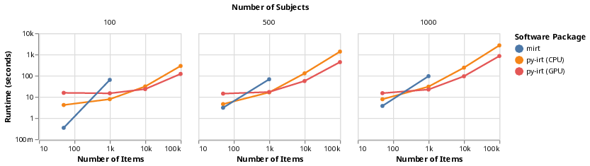
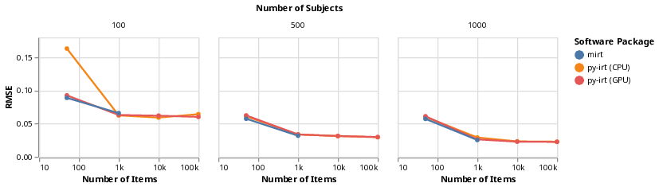

[](https://pubsonline.informs.org/journal/ijoc)


# py-irt: A Scalable Item Response Theory Library for Python

This archive is distributed in association with the [INFORMS Journal on
Computing](https://pubsonline.informs.org/journal/ijoc) under the [MIT License](LICENSE).

The software and data in this repository are a snapshot of the software and data
that were used in the research reported on in the paper 
[This is a Template](https://doi.org/10.1287/ijoc.2019.0934) by J.P. Lalor and P. Rodriguez. 
The snapshot is based on 
[this SHA](https://github.com/nd-ball/py-irt/commit/6c69584a42d34bd2b4fd1d43550ef7fbb92b755d) 
in the development repository. 

**Important: This code is being developed on an on-going basis at 
https://github.com/nd-ball/py-irt. Please go there if you would like to
get a more recent version or would like support**

## Cite

**TODO**

To cite this software, please cite the [paper](https://doi.org/10.1287/ijoc.2019.0934) using its DOI and the software itself, using the following DOI.

[](https://zenodo.org/badge/latestdoi/285853815)

Below is the BibTex for citing this version of the code.

```
@article{PyIrt,
  author =        {Lalor, John P and Rodriguez, Pedro},
  publisher =     {INFORMS Journal on Computing},
  title =         {{py-irt} Version v0.4.5},
  year =          {2022},
  doi =           {TODO},
  url =           {https://github.com/INFORMSJoC/2022.0061},
}  
```

## Description

This repository includes code for fitting Item Response Theory (IRT) models using variational inference.

At present, the one parameter logistic (1PL) model, aka Rasch model, two parameter logistic model (2PL) and four parameter logistic model (4PL) have been implemented.
The user can specify whether vague or hierarchical priors are used.
The three-parameter logistic model is in the pipeline and will be added when available.

## License

py-irt is licensed under the [MIT license](https://opensource.org/licenses/MIT).

## Installation

py-irt is now available on PyPi!
The instructions below will install this snapshot version of py-irt.
For instructions on installing the latest version, please visit https://github.com/nd-ball/py-irt.

### Pre-reqs

1. Install [PyTorch](https://pytorch.org/get-started/locally/).
2. Install [Pyro](https://pyro.ai/)
3. Install py-irt:

```shell
pip install py-irt==0.4.5
```

OR

Install [Poetry](https://python-poetry.org/docs/#installation)

```shell
git clone https://github.com/INFORMSJoC/2022.0061.git
cd py-irt
poetry install
```

## Results

Figure 6 in the paper shows the results of comparing runtime between py-irt and mirt on various data set sizes.



Figure 7 in the paper shows RMSE for predicting the probability of a correct response from 2PL models with varying levels of items and subjects.



## Ongoing Development

This code is being developed on an on-going basis at the package
[Github site](https://github.com/nd-ball/py-irt).

## Support

For support in using this software, submit an
[issue](https://github.com/nd-ball/py-irt/issues/new).

## Usage

Once you install from PyPI, you can use the following command to fit an IRT
model on the scored predictions of a dataset. For example, if you were to run py-irt with the 4PL model on the scored predictions of different transformer models on the SQuAD dataset, you'd do this:
`py-irt train 4pl ~/path/to/dataset/eg/squad.jsonlines /path/to/output/eg/test-4pl/`

## FAQ

1. What kind of output should I expect on running the command to train an IRT model?

You should see something like this when you run the command given above:


2. I tried installing py-irt using pip from PyPI. But when I try to run the command `py-irt train 4pl ~/path/to/dataset/eg/squad.jsonlines /path/to/output/eg/test-4pl/`, I get an error that says `bash: py-irt: command not found`. How do I fix this?

The CLI interface was implemented in PyPi version 0.2.1. If you are getting this error try updating py-irt:

`pip install --upgrade py-irt`

Alternatively, you can install the latest version from github:

```shell
git clone https://github.com/nd-ball/py-irt.git
cd py-irt
mv ~/py-irt/py_irt/cli.py ~/py-irt/
python cli.py train 4pl ~/path/to/dataset/eg/squad.jsonlines /path/to/output/eg/test-4pl/
```

3. How do I evaluate a trained IRT model?

If you have already trained an IRT model you can use the following command:

`py-irt evaluate 4pl ~/path/to/data/best_parameters.json ~/path/to/data/test_pairs.jsonlines /path/to/output/eg/test-4pl/`

Where `test_pairs.jsonlines` is a jsonlines file with the following format:

```
{"subject_id": "ken", "item_id": "q1"}
{"subject_id": "ken", "item_id": "q2"}
{"subject_id": "burt", "item_id": "q1"}
{"subject_id": "burt", "item_id": "q3"}
```

If you would like to both train and evaluate a model you can use the following command:

`py-irt train-and-evaluate 4pl ~/path/to/data/squad.jsonlines /path/to/output/eg/test-4pl/`

By default this will train a model with 90% of the provided data and evaluate with the remaining 10%.
To change this behavior you can add `--evaluation all` to the command above. 
The model will train and evaluate against all of the data.

## Citations

If you use this code, please consider citing the following papers:

```shell
@inproceedings{lalor2019emnlp,
  author    = {Lalor, John P and Wu, Hao and Yu, Hong},
  title     = {Learning Latent Parameters without Human Response Patterns: Item Response Theory with Artificial Crowds},
  year      = {2019},
  booktitle = {Proceedings of the 2019 Conference on Empirical Methods in Natural Language Processing},
}
```

```shell
@inproceedings{rodriguez2021evaluation,
  title={Evaluation Examples Are Not Equally Informative: How Should That Change NLP Leaderboards?},
  author={Rodriguez, Pedro and Barrow, Joe and Hoyle, Alexander Miserlis and Lalor, John P and Jia, Robin and Boyd-Graber, Jordan},
  booktitle={Proceedings of the 59th Annual Meeting of the Association for Computational Linguistics and the 11th International Joint Conference on Natural Language Processing (Volume 1: Long Papers)},
  pages={4486--4503},
  year={2021}
}
```

Implementation is based on the following paper:

```shell
@article{natesan2016bayesian,
  title={Bayesian prior choice in IRT estimation using MCMC and variational Bayes},
  author={Natesan, Prathiba and Nandakumar, Ratna and Minka, Tom and Rubright, Jonathan D},
  journal={Frontiers in psychology},
  volume={7},
  pages={1422},
  year={2016},
  publisher={Frontiers}
}
```

## Contributing

This is research code. Pull requests and issues are welcome!

## Questions?

Let me know if you have any requests, bugs, etc.

Email: john.lalor@nd.edu
